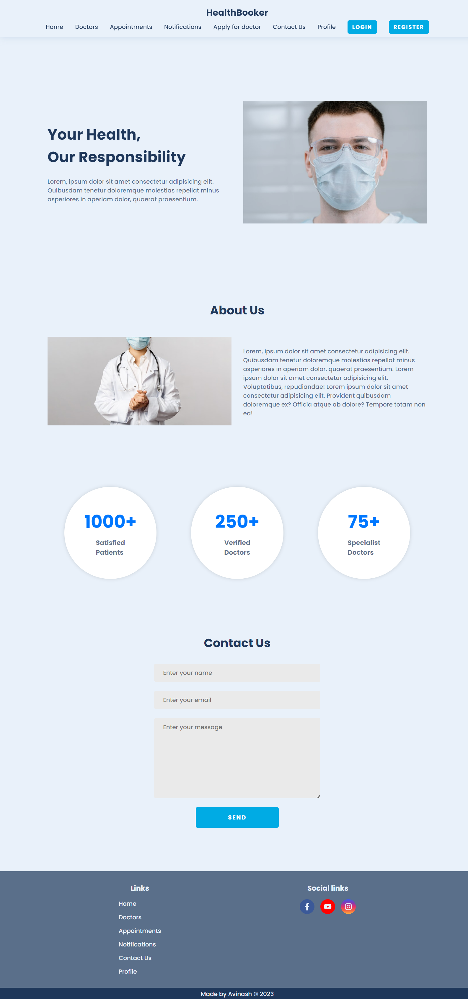
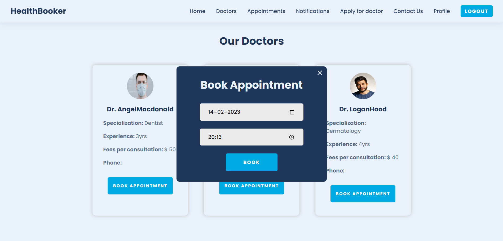

### Steps to run the project on your local machine

<ol>
<li>Fork this repository</li>
<li>Open terminal or command prompt on your local machine. Run the following command to clone the repository:</li>

```
git clone https://github.com/your-username/your-repo.git
```

Replace **your-username** with your GitHub username and **your-repo** with the name of your repository.

<li>Open the project and rename <strong>.env.example</strong> files to <strong>.env</strong> in both client and root directory.</li>

<li>Add your own environment variables to these both files.</li>

<li>To run the backend, open a new terminal and execute:</li>

```
npm start
```

<li>To run the frontend, open a new terminal and run 'cd client/' to go to client directory and execute: </li>

```
npm start
```

</ol>

### To access the admin dashboard

<ol>
<li>Download the project from the git repository</li>
<li>You need to create your own MongoDB instance and add the MongoDB url to the .env file</li>
<li>Register on the website and go to your MongoDB and manually change the 'isAdmin' field of the account you want to make admin in the DB to 'true' and then log in back on the site</li>
<li>Now you will be able to access the admin dashboard</li>
</ol>

---

<p align="right"><a href="#top">Back to Top</a></p>

### Home page



### Sign up page


### Sign in page


### Profile page


### All Doctors page


### Apply for doctor page


### Admin all users dashboard


### Admin all applications page


### Book Appointment page



### Users all appointments page


### Doctors all appointments page


### Notifications page


---

<br/>

### 🛡️ License

[](https://opensource.org/licenses/MIT)

Terms and conditions for use, reproduction and distribution are under the [MIT License](https://opensource.org/license/mit/).

<br/>

---

<h3 align="center"> Give it a 🌟 if you 🧡 this repository </h3>

---

<p align="right"><a href="#top">Back to Top</a></p>

</div>
